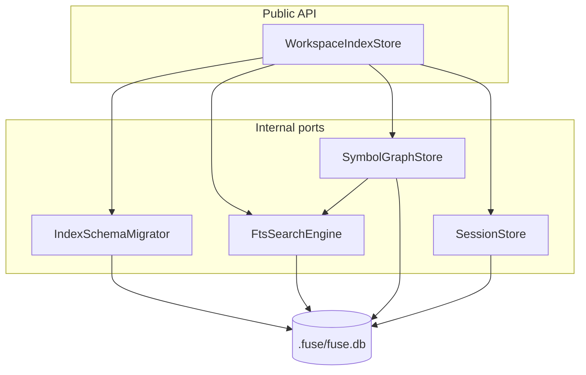
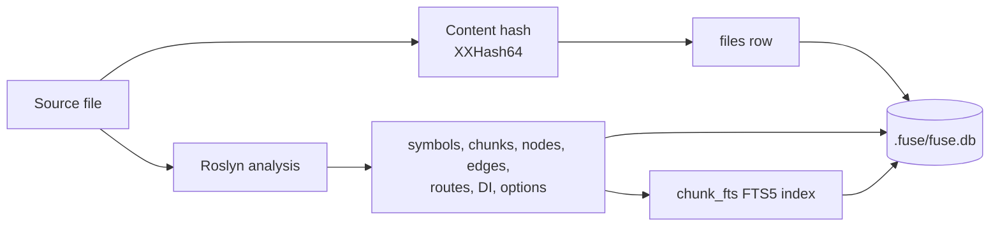

Indexing a workspace is repeatable work: the same source yields the same symbols, chunks, and wiring edges. Fuse persists that graph in one SQLite file so a warm call reads precomputed structure instead of re-analyzing, and an edit re-indexes only changed files. This page documents where the store lives, its layout, how content hashing drives incremental updates, and how the bounded host-memory cache fits in.

This page is for maintainers working on the store and for engineers diagnosing why a call did or did not see fresh data.

## Implementation context

The store trades disk for compute. File records carry a content hash, so an edited file is detected and its derived rows are replaced; an unchanged file is skipped. Because every row is derived from source, a lost or corrupt store costs only a rebuild, never a wrong answer.

## Location and layout

All semantic index data lives in a single SQLite database file named `fuse.db`. Placement depends on whether the workspace is inside a git repository:

| Context | Indexed MCP behavior | Path |
|---------|----------------------|------|
| Inside a Git repo | Enabled. The nearest enclosing `.git` directory or file defines the canonical identity. | `{repoRoot}/.fuse/fuse.db`, never under the requested nested directory |
| Outside a Git repo | Refused with `workspace_identity_unresolved:` before a daemon or index starts. `fuse_reduce` remains available. | One-shot non-MCP paths retain the per-directory fallback at `~/.fuse/roots/{hash}/fuse.db` (override the base with `FUSE_USER_DATA`). |

Reduction output and per-file analysis are not stored in `.fuse`. The host registers one `MemoryStoreFactory` for its lifetime and retains up to 64 MiB of encoded entries across repository-scoped cache views. Least-recently-used entries leave memory first. Stopping the daemon, or finishing a one-shot command, drops that cache. Fuse never creates `fuse-cache.db`.

Each non-Git directory gets its own per-root store for non-MCP callers (R34), so two unrelated directories never share data. Workspace-scoped MCP tools deliberately do not use this fallback because there is no repository identity for the daemon, lock, and query root to share. The per-root stores under `~/.fuse/roots/` are derived data and can be deleted. The pre-4.2 single shared `~/.fuse/fuse.db` fallback is abandoned, not migrated; delete it if it lingers.

Repository identity is resolved before storage, locking, daemon attachment, or querying. Fuse walks upward from the requested directory to the nearest `.git` marker. A `.git` file is valid because linked worktrees use that form. The normalized root is the shared key for the daemon endpoint, cold-build coordinator, writer mutex, and database path. For example, a request from `repo/tests/App.Tests/bin/Release/net10.0` resolves to `repo`; it cannot scan that output folder while writing `repo/.fuse/fuse.db`.

## Store modules (R9)

`WorkspaceIndexStore` is the only public entry for host and MCP callers. Implementation is split across four internal ports in `Fuse.Indexing`; the facade wires lifecycle, delegates reads and writes, and owns the connection factory.

| Port | Responsibility |
|------|----------------|
| `IndexSchemaMigrator` | Pragmas, `schema_version` migration and rebuild, relational DDL ensure, `index_meta` read/write, row counts for state |
| `FtsSearchEngine` | FTS5 availability probe, `chunk_fts` indexing on chunk upsert/delete, BM25-ranked `SearchAsync` |
| `SymbolGraphStore` | Files, projects, symbols, chunks (relational), nodes, edges, routes, DI and options bindings, graph and symbol queries |
| `SessionStore` | `check_sessions` baselines and `claim_ledger` rows, session listing per workspace root |

The file uses WAL journal mode with `synchronous = NORMAL`, `wal_autocheckpoint = 1000`, a 64 MiB journal-size limit, incremental auto-vacuum, and foreign keys on. It is a relational schema, not a key-value cache: separate tables hold files, projects, symbols, chunks, semantic nodes, typed edges, routes, DI registrations, and options bindings. `search_documents` maps chunks to a contentless-delete FTS5 row, preventing a second relational copy of indexed source text. `files.index_detail` records `full`, `declarations`, or `inventory_only`; generated code retains declarations and outlines without method bodies or comments, and files above the 5 MiB source limit retain inventory metadata only. `tfm_availability` records each target framework in which a canonical semantic fact exists; shared multi-target declarations therefore occupy one semantic row and several availability rows, while target-exclusive facts remain present. A `schema_version` row gates migration: a database older than the current version is deleted and rebuilt rather than migrated in place.

The `files` table carries a `language` column tagged from the provider that claims each file's extension (for example `csharp`, `python`), so retrieval can filter or blend by language over the language-agnostic tables; symbols and nodes inherit their language through their `file_id`. Adding the column is a schema version bump (currently 14), so the index rebuilds on the next run.

## Content hashing and incremental update

Inventory starts with `git ls-files -s -z` and porcelain-v2 status. Clean tracked files reuse their Git blob ids without opening source files. Dirty and untracked files stream SHA-256 only when required. A warm reconcile compares those values with stored hashes: an unchanged hash is left as is; an added or edited file is extracted; a removed file is hard-deleted from `files`, its derived tables, and FTS rows. Extraction remains proportional to changed files.

Every completed build publishes a `WorkspaceIndexManifest` in `index_meta`. It contains the normalized repository root, a `ready` build state, the complete file count, an inventory hash over each normalized path and content hash, and a completion timestamp. The build writes `building` before changing derived rows and writes `ready` last. A process interruption therefore cannot turn a partial write into a warm index.

## Symbol and chunk identity

Symbols carry a stable id so the same declaration keeps its identity across re-indexes: `symbol:{assembly}:{kind}:{hash}` from the Roslyn documentation-comment id when the workspace loads semantically, and a source-only fallback id (`symbol:fallback:{path}:{kind}:{name}:{line}`) when it does not. Chunks carry a text hash and a token estimate so the renderer can plan a budget without re-reading the file, and the FTS5 row for a chunk is maintained on every upsert and delete so full-text search never returns a stale chunk.

## Concurrency

Writes within an index batch run in one transaction; reads use pooled connections and a per-connection busy timeout. Across processes, safety comes from WAL mode and content-addressed rows: because a row is derived from a content hash, a concurrent rebuild can only recompute the same bytes, never produce a conflicting answer. The MCP server and the host hold one store open across calls so the warm graph is shared by every call in the session.

The `IndexCoordinator` (MCP host and CLI) enforces single-writer discipline per canonical repository root: an in-process queue serializes write paths (`InitializeAsync`, `fuse index`, background semantic upgrade), and a per-root named mutex (`fuse-index-writer-{hash}`) arbitrates cross-process contention. Root and nested paths resolve to the same queue and mutex. A second process that cannot acquire the writer mutex receives `index_busy:` instead of blocking on SQLite or surfacing an opaque exception. Foreground read tools use `OpenForReadAsync` and do not take the writer mutex, so warm reads can proceed while a background upgrade commits in chunks (per project and per 50 files).

Warm foreground reads use a read-only open path (`OpenForReadAsync`): when `fuse.db` already exists at the current schema version, the store verifies the on-disk version and reads FTS availability from `index_meta` without writing metadata. That avoids turning every read into a meta write (which contended with background semantic upgrades under WAL). Write initialization (`InitializeAsync`) runs on first create, schema migration, incompatible-version rebuild, and explicit `fuse index`; it applies migrations, probes FTS5, and stamps `index_meta` once. A background upgrade writer and multiple concurrent read opens can therefore share the same populated database without the read path acquiring a write lock for meta updates.

## What forces a rebuild

Index reuse is gated on two versions, never the product version. The relational **schema version**
(`WorkspaceIndexSchema.TargetVersion`) gates structure, and the **extraction-contract version**
(`WorkspaceIndexSchema.ExtractionContractVersion`, stamped as `index_extraction_version` in `index_meta`)
gates what the indexer extracts (symbol, edge, chunk, and route semantics). A store is reused when both
match; a mismatch rebuilds. The `fuse_version` stamp is kept for diagnostics only and no longer forces a
rebuild, so a minor or patch upgrade (auto-update is default-on) reuses a good index instead of discarding
it on every cosmetic bump. Bump `ExtractionContractVersion` in the same change as any extractor behavior
change; a forgotten bump is the only failure mode, never routine over-rebuilding. A pre-R22 store that
carries only `fuse_version` (no extraction stamp) rebuilds once to gain the stamp, then reuses thereafter.

## Rebuild to a working, searchable index

A version or schema mismatch (and corruption) rebuilds the store's derived data from scratch, and the rebuild always lands on a store that can actually answer a search. Every initialization path, including the incompatible-version rebuild, flows through the FTS5 probe and re-creates `chunk_fts`, then stamps FTS availability and the index mode; the read path returns `index_rebuilding:` until the next pass repopulates chunks. Earlier the version-mismatch path returned before the FTS probe, so a rebuilt store had indexed files but no `chunk_fts`, and the next search threw `no such table: chunk_fts`.

### Index invariants (self-verifying)

A store that is internally inconsistent is never reported `ready`. On open and on every status read, cheap state-based invariants are checked (`IndexIntegrity`): the schema version is set, the index mode is set (never `unknown`), and chunks exist when symbols exist on an FTS-available runtime (otherwise search over indexed source would be empty). A store failing any invariant reports `index_rebuilding` and is repaired via the rebuild path, rather than served empty as `ready` (the dogfood's 0-chunk, mode=`unknown` store is the canonical case). A full index pass records the result under `index_integrity` in `index_meta`, and `fuse_workspace action=status`/`doctor` surface the live integrity line.

The manifest adds workspace and inventory invariants. A populated database with no manifest, a `building` marker, a root mismatch, a count mismatch, or an inventory-hash mismatch is not warm. The first indexed read starts a syntax-first replacement and returns the bounded build state when it exceeds the cold-read deadline. This covers an index containing a handful of output artifacts: a nonzero `files` count can no longer suppress repository indexing.

FTS availability is a single source of truth. Both `OpenForReadAsync` and `GetStateAsync` reconcile the stored `fts_available` stamp against the actual presence of the `chunk_fts` table, so the availability line and the status body never disagree. A store whose stamp says available but whose table is missing does not open ready: it forces a rebuild. A search issued against a store missing `chunk_fts` raises `SearchIndexUnavailableException`, which the operational-error boundary maps to `index_rebuilding:` and never to a raw `internal_error`. A store with indexed symbols but zero chunks on an FTS-available runtime is internally inconsistent and is never reported `ready`; it reports `index_rebuilding` so the read path repairs it.

## The reduction cache

Rendering a planned file to a token-reduced form is also repeatable, and that reduced output is cached so an unchanged file under the same reduction level is not reduced twice while the host remains alive. The reduction cache is keyed by a content hash combined with a hash of the reduction options, so any change to the file or level yields a distinct entry. Reduction and analysis entries share the daemon-owned 64 MiB memory budget. The cache is repository-scoped, uses least-recently-used eviction, and never writes `.fuse/fuse-cache.db`.

## What this does not cover

This page documents the store and its update model. It does not document the analyzers that produce the edges (see [The Fuse pipeline](/docs/internals/pipeline)) or the retrieval that reads them (see [Retrieval internals](/docs/internals/scoping-internals)).

## Next

See [The Fuse pipeline](/docs/internals/pipeline) for where indexing and rendering sit, [Performance](/docs/project/performance) for cold-versus-warm timings, and [Operator guide](/docs/internals/operator) for reset and environment variables.
